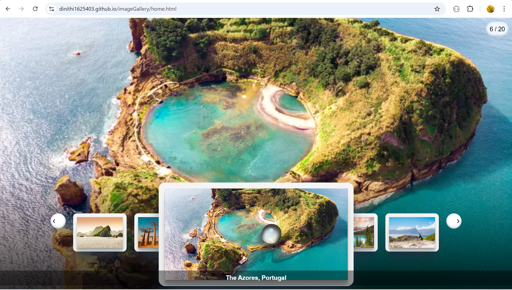
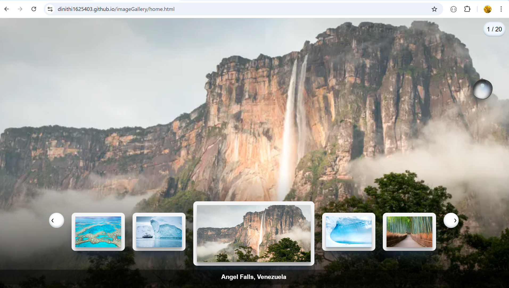

<h1 align="center" id="title">Image Gallery</h1>

<p align="center"></p>

<p id="description">Image Gallery is a web-based project developed using HTML CSS and JavaScript. It provides a visually appealing and interactive platform to display and organize images. The project features dynamic image filtering and hover effects offering a seamless and engaging experience tailored for users.</p>

<h2>🚀 Demo</h2>

[https://dinithi1625403.github.io/imageGallery/](https://dinithi1625403.github.io/imageGallery/)

<h2>Project Screenshots:</h2>




  
  
<h2>🧐 Features</h2>

Here're some of the project's best features:

*   Lightbox View: View images in a pop-up overlay without opening a new tab.
*   Hover Effects: Add animations or visual effects when hovering over images.
*   Captions/Descriptions: Display captions below each image for context or additional details.
*   Grid Layout: Images are displayed in a simple and organized grid format.

<h2>🛠️ Installation Steps:</h2>

<p>1. Clone the Repository Use the following command to clone the project to your local machine:</p>

```
git clone https://github.com/dinithi1625403/imageGallery.git
```

<p>2. Navigate to the Project Folder Open the folder containing the project files:</p>

```
cd imageGallery
```

<p>3. Open the Application Simply open the index.html file in your browser to view the gallery: On Windows: Double-click the file. On Mac/Linux: Use a browser or right-click and choose "Open With Browser."</p>

<p>4. Optional: Host the Project Locally If you prefer to test the project on a local server: Use a tool like Live Server in VS Code or: bash Copy code Open http://localhost:8000 in your browser.</p>

```
python -m http.server  
```

  
  
<h2>💻 Built with</h2>

Technologies used in the project:

*   HTML
*   CSS
*   JS
*   Canva
